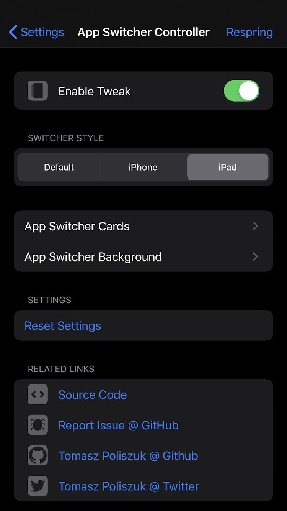
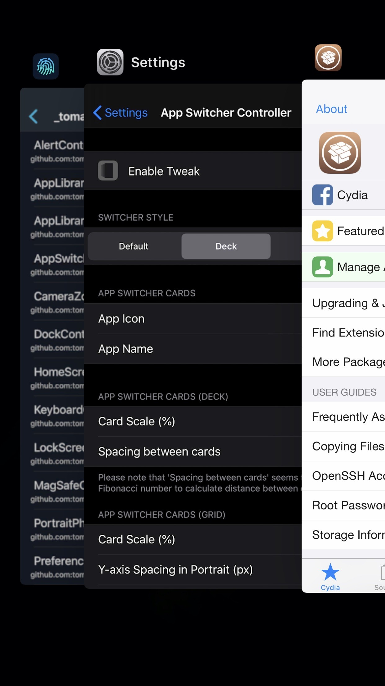

*App Switcher Controller - Control your App Switcher*

**Requires iOS greater or equal to 13**

**Possibilities:**
- Choose Switcher Style (Default, iPhone, iPad)
- App Switcher Cards:
- - App Icon (enabled, disabled)
- - App Name (enabled, disabled)
- App Switcher Background:
- - Wallpaper Scale
- - HomeScreen Scale
- - HomeScreen Opacity
- - Blur
- - Dimming

Configure options from Settings.

**Screenshots:**

