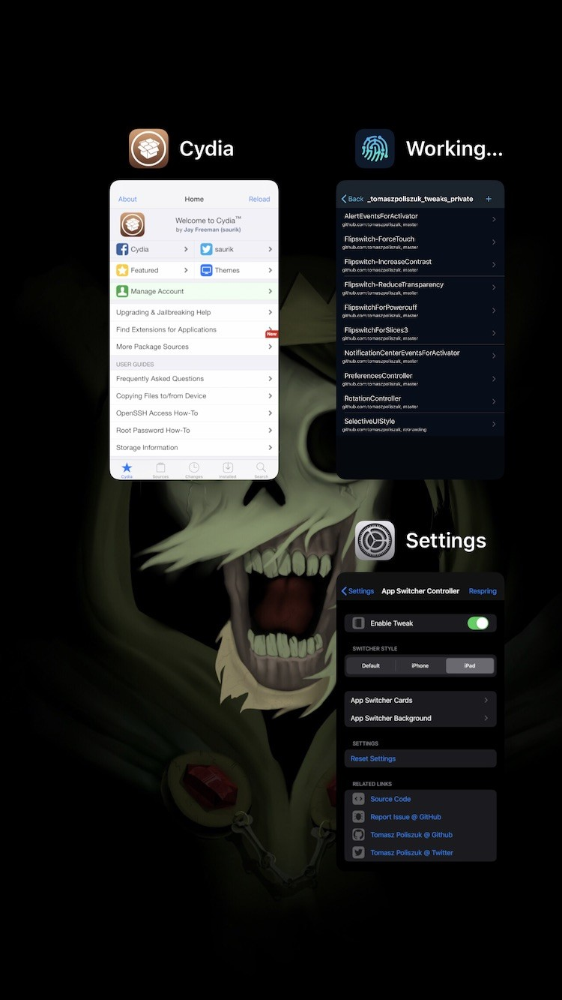

# App Switcher Controller
Control your App Switcher

## Compatibility
* iOS 12 and above

## What this tweak do:
* Choose Switcher Style (Default, Deck, Grid)
* App Switcher Cards:
    * App Icon (enabled, disabled)
    * App Name (enabled, disabled)
* App Switcher Cards (Deck):
    * Card Scale (%)
    * Spacing between cards
* App Switcher Cards (Grid)
    * Card Scale (%)
    * Y-axis Spacing in Portrait (px)
    * X-axis Spacing in Portrait (px)
    * Y-axis Spacing in Landscape (px)
    * X-axis Spacing in Landscape (px)
* App Switcher Background:
    * Wallpaper Scale
    * HomeScreen Scale
    * HomeScreen Opacity
    * Blur
    * Dimming

Configure options from Settings.

**Screenshots:**

