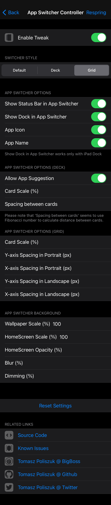
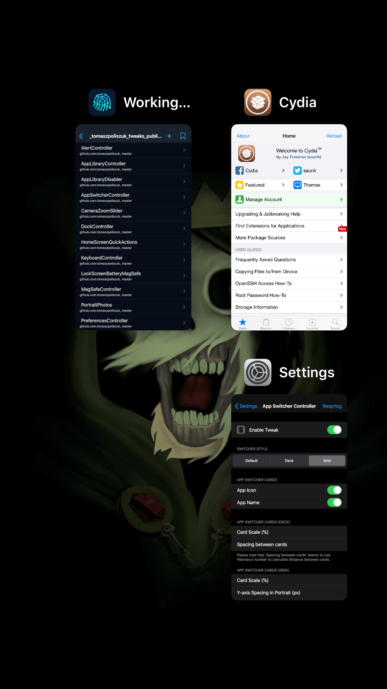

# App Switcher Controller
Control your App Switcher

## Compatibility
* iOS 12 and above

## Features:
* Choose Switcher Style (Default, Deck, Grid)
* App Switcher Options:
	* Show Status Bar in App Switcher (enabled, disabled) - iOS 13+
	* Show iPad Dock in App Switcher (enabled, disabled)
	* App Icon (enabled, disabled)
	* App Name (enabled, disabled)
* App Switcher Options (Deck):
	* Allow App Suggestion
	* Card Scale (%)
	* Spacing between cards
* App Switcher Options (Grid)
	* Card Scale (%)
	* Y-axis Spacing in Portrait (px)
	* X-axis Spacing in Portrait (px)
	* Y-axis Spacing in Landscape (px)
	* X-axis Spacing in Landscape (px)
* App Switcher Background:
	* Wallpaper Scale
	* HomeScreen Scale
	* HomeScreen Opacity
	* Blur
	* Dimming

**Configure options from Settings.**

## Credits:
* [Kritanta](https://github.com/KritantaDev) for [macros from stratosphere pull request](https://github.com/Samgisaninja/stratosphere/pull/1#pullrequestreview-542780232) - it's better to DRY

**Screenshots:**

